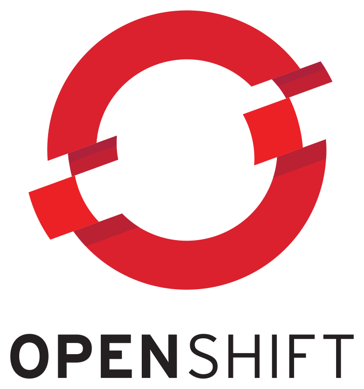
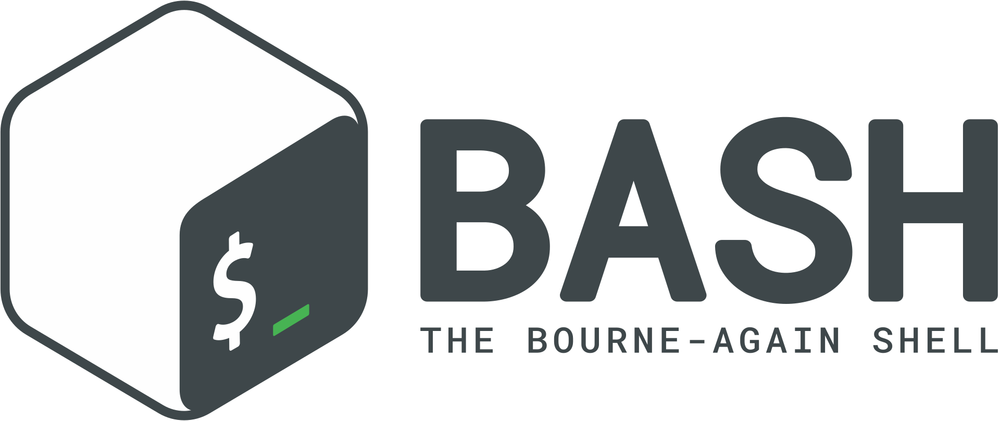
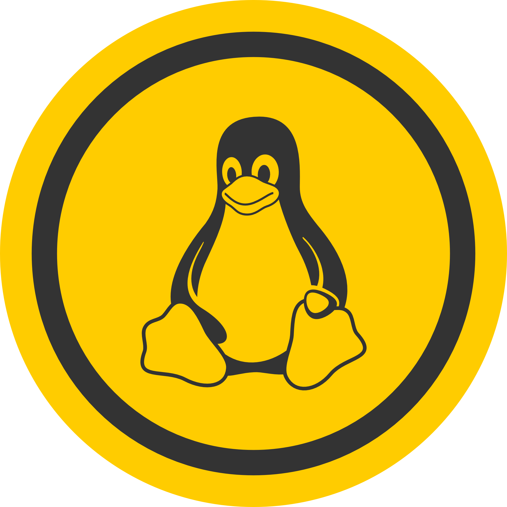
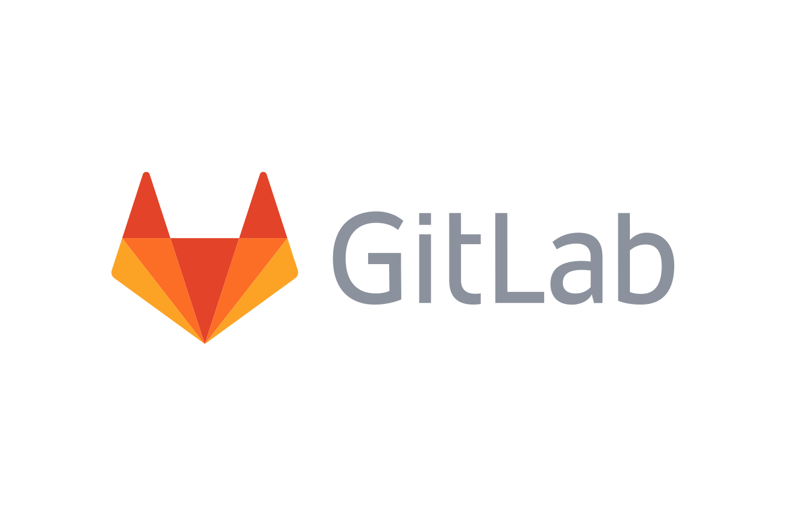
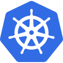
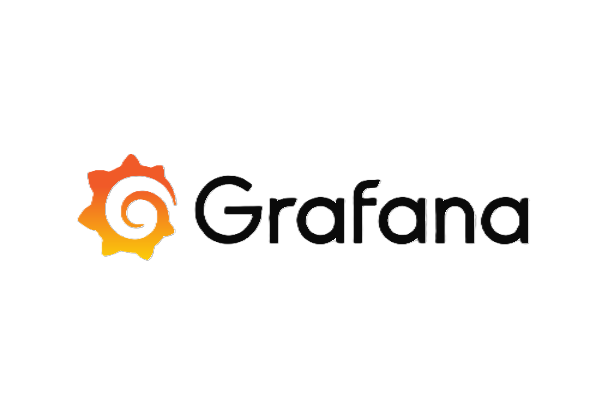
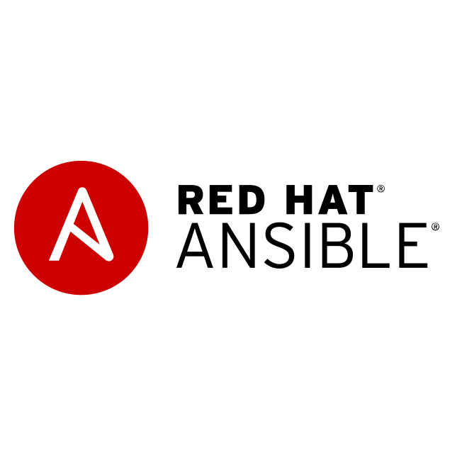

  

###

  
  
  

###

  

###

<h1 align="center">Hey There 👋</h1>

###

<h3 align="left">👩‍💻  About Me</h3>

###

I'm Arun Kushwaha from Mumbai, Maharashtra   - 🔭 I'm a passionate DevOps engineer with a strong background in cloud infrastructure, automation, and container orchestration. - 📚 I thrive on solving complex problems, from migrating monolithic applications to microservices architectures and optimizing Kubernetes workloads for better cluster performance. - ⚡ Proficient in managing and monitoring cloud resources with tools like Terraform and AWS, I'm also enhancing my skills in OpenShift and learning Golang to implement best practices in a DevOps playground.  

###

<h3 align="left">🛠 Language and tools</h3>

###

  
  
  
  
  
  
  
  
  
  
  
  
  
  
  
  
  
  
  
  
  
  
    

###
<!--
<h3 align="left">🔥   My Stats :</h3>

###

  

###
-->
