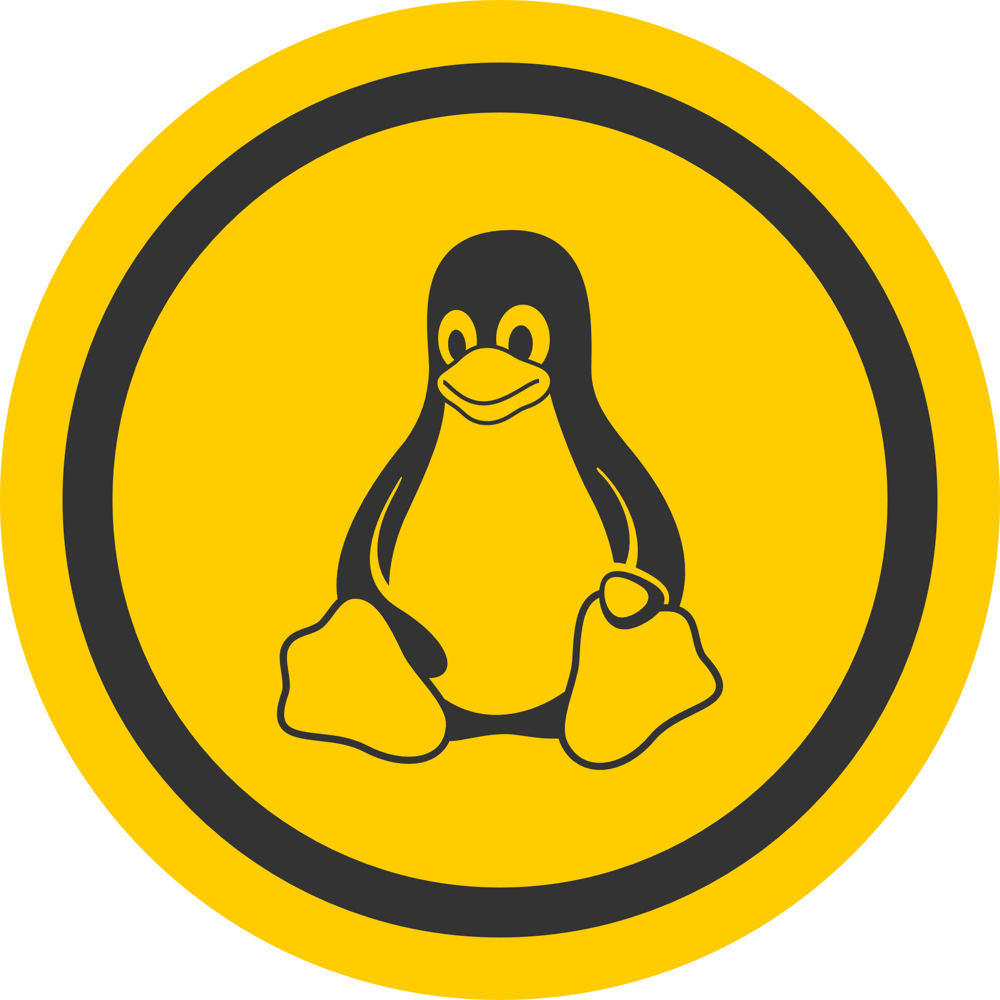
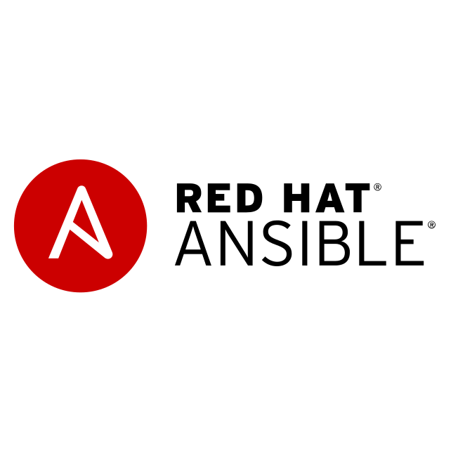

  

###

  
  
  

###

  

###

<h1 align="center">hey there 👋</h1>

###

<h3 align="left">👩‍💻  About Me</h3>

###

I'm Arun Kushwaha from Mumbai, Maharashtra   - 🔭 I’m working as DevOps Engineer - 📚 I'm currently learning GO and Openshift - ⚡ In my free time I spend time with friends and family. 

###

<h3 align="left">🛠 Language and tools</h3>

###

  
  
  
  
  
  
  
  
  
  
  
  
  
  
  
  
  
  
  
  
  
  
    

###
<!--
<h3 align="left">🔥   My Stats :</h3>

###

  

###
-->
